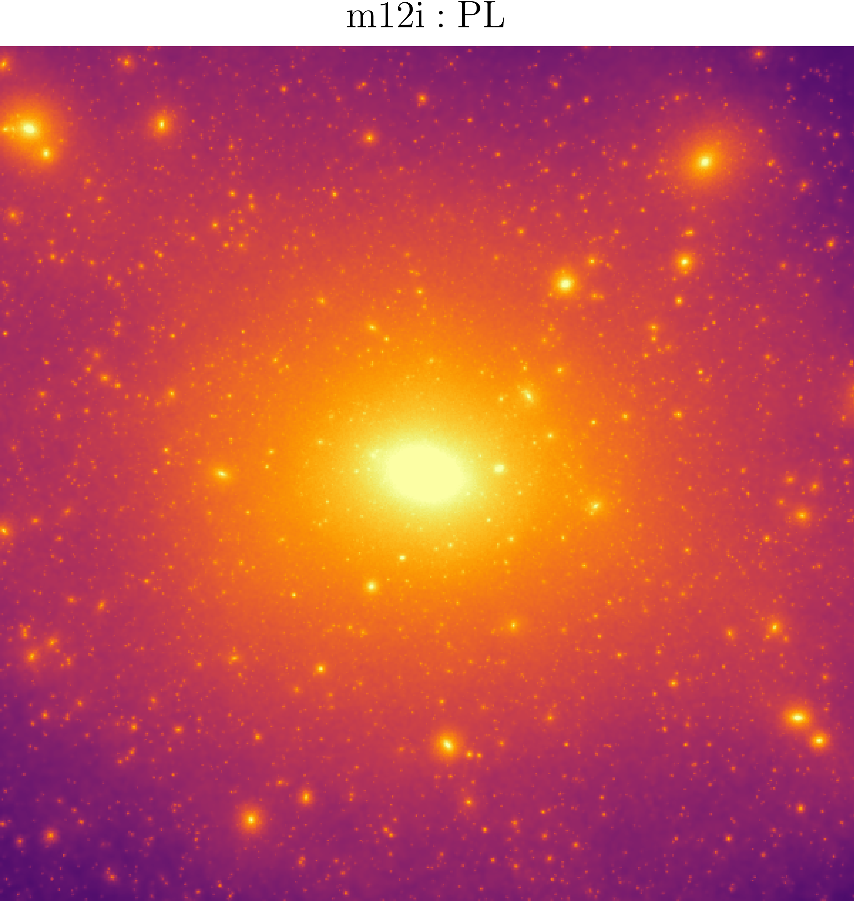
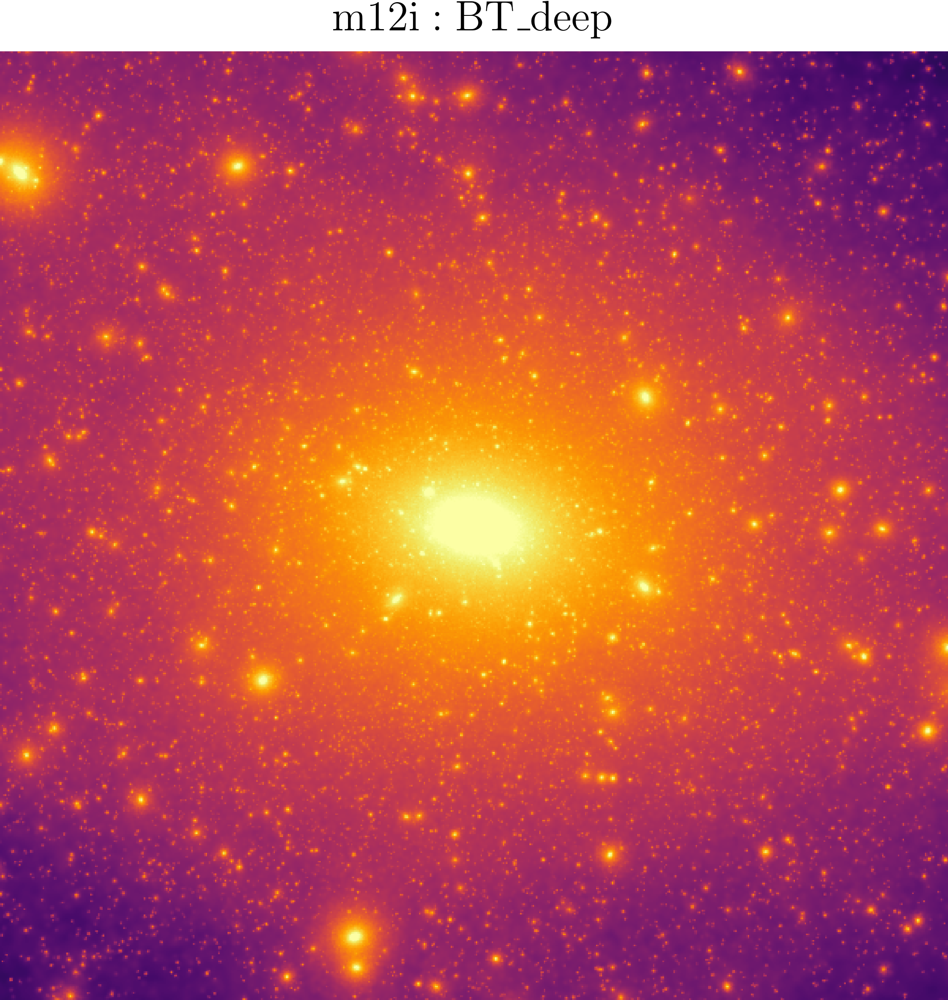
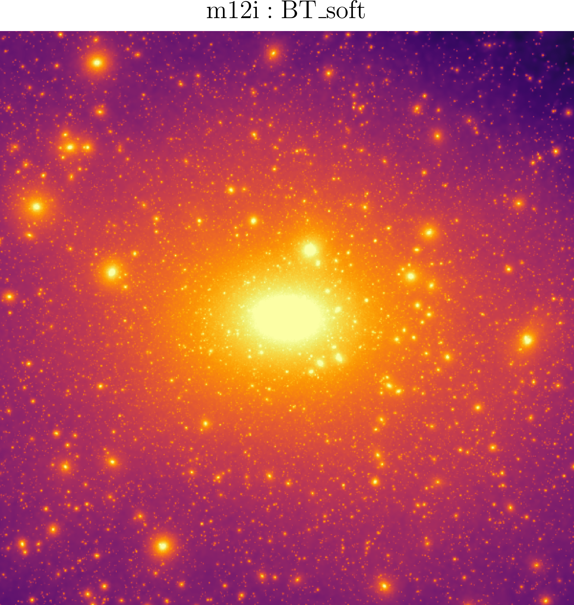

# btmw — Blue-Tilt Milky-Way simulations

[](https://arxiv.org/abs/2412.16072)
[](https://doi.org/10.1103/59fw-974t)
[](https://doi.org/10.5281/zenodo.20805091)
[](https://doi.org/10.5281/zenodo.20805010)
[](LICENSE)

**Jianhao Wu** [](https://orcid.org/0009-0000-7431-7885) (CUHK) · **Tsang Keung Chan** [](https://orcid.org/0000-0003-2544-054X) (CUHK) · **Victor J. Forouhar Moreno** [](https://orcid.org/0000-0003-1308-9908) (Leiden Observatory)

Analysis code for the **blue-tilt primordial power-spectrum × Milky-Way simulation** analysis presented in:

> J. Wu, T. K. Chan, V. J. Forouhar Moreno,
> *"Cosmological zoom-in simulations of Milky Way host mass dark matter halos with a blue-tilted primordial power spectrum"*,
> Phys. Rev. D, [10.1103/59fw-974t](https://doi.org/10.1103/59fw-974t) (arXiv:[2412.16072](https://arxiv.org/abs/2412.16072)).

This repository reproduces every figure in the paper from raw simulation outputs (SWIFT snapshots + SOAP / HBT-HERONS / VELOCIraptor catalogs), with intermediate per-figure caches checked in so each figure can also be regenerated quickly without access to the raw data.

<p align="center">
  
  
  
  <br>
  <em>Figure 4 — DM mass projection (200 kpc half-width) of the m12i zoom-in halo under three primordial power spectra: PL (left), BT_deep (centre), BT_soft (right).</em>
</p>

---

## Data

The raw simulation outputs (SOAP catalogues, HBT-HERONS catalogues, VELOCIraptor catalogues, SWIFT snapshots) are archived separately on Zenodo:

> **Raw data:** [10.5281/zenodo.20805010](https://doi.org/10.5281/zenodo.20805010)

Download and extract the archive, then point `BTMW_SIM_ROOT` to the extracted directory (see [Configuration](#configuration)). The raw data is only needed if you want to re-extract figures from scratch with `--refresh` or run `projection-map`; all other figures can be reproduced from the checked-in caches without it.

This code repository itself is also archived on Zenodo:

> **Code:** [10.5281/zenodo.20805091](https://doi.org/10.5281/zenodo.20805091)

---

## Installation

```bash
# Requires: Python >=3.10, a working LaTeX install for figure rendering.
git clone https://github.com/rushingfox/btmw.git
cd btmw

conda create -n btmw python=3.10 -y
conda activate btmw

pip install -e .
```

After installation, the `btmw` command is available in your shell from any directory. Edits to files under `src/btmw/` take effect immediately — no reinstall needed. If you don't want LaTeX rendering, pass `--no-tex` to any plotting subcommand.

To run the public smoke tests (always run this after install to confirm the package, configs, external data, and CLI resolve):

```bash
pytest tests/test_smoke.py
```

The remaining regression tests compare checked-in caches against the original archive and/or raw simulation outputs on the CUHK cluster. They are intended for author-side validation rather than as a public installation check.

---

## Repository layout

```
configs/
  simulations.yaml      # SOAP / HBT / VR / snapshot paths for all 9 zoom sims
data/
  external/             # digitized reference curves (COCO, Cautun, Aquarius, ...)
  cache/                # per-figure intermediate npz/txt files (small, in git)
src/btmw/
  cli.py                # argparse-based subcommand dispatcher
  config.py             # YAML loader for simulations.yaml
  paths.py              # repo path resolution (root, configs, data, ...)
  style.py              # matplotlib style (Helvetica + usetex; --no-tex support)
  defaults.py           # physical constants, unit conversions, figure defaults
  io_soap.py            # h5py readers for SOAP halo catalogs
  figures/              # one module per paper figure (extract + plot)
scripts/
  *.sbatch              # cluster job templates
tests/
  test_smoke.py         # CLI / config / external-data smoke tests
figures/                # output PNGs — tracked in git so figures are reproducible from git alone
figures_static/         # conceptual_flow.png (hand-drawn fig 1, PRD version)
logs/                   # sbatch stdout/stderr (gitignored except .gitkeep)
```

---

## Configuration

[configs/simulations.yaml](configs/simulations.yaml) lists the nine zoom simulations used in the paper (six fiducial-resolution + three high-resolution m12i variants) with path templates for their SOAP, HBT-HERONS, VELOCIraptor, and snapshot files.

To use a different copy of the raw data with the same directory layout, set:

```bash
export BTMW_SIM_ROOT=/path/to/simulation_root
```

This tells btmw where your simulation files live. If your directory layout differs, edit the path templates in [configs/simulations.yaml](configs/simulations.yaml).

---

## Reproducing the paper figures

Figures 4–18 are fully reproduced by this pipeline. Three figures are excluded by design:

- **Fig 1** — hand-drawn conceptual flow; included as a static asset (`figures_static/conceptual_flow.png`), not regenerated from code.
- **Fig 2** — power-spectrum plot generated from the `input_powerspec.txt` output of [MUSIC](https://github.com/lue/music); not reproduced by this pipeline.
- **Fig 3** — HMF curve from the external `genmf` C program; not reproduced here.

Where the paper has both an arXiv v1 and a **PRD version**, this pipeline targets the PRD version (figs 1, 5-right-panel, 11) and falls back to v1 for everything else.

```bash
# Fig 4: matter projection maps (m12i CDMO / BT_deep / BT_soft) — uses swiftsimio
btmw projection-map --sim m12i_cdmo
btmw projection-map --sim m12i_btps_deep
btmw projection-map --sim m12i_btps_soft

# Fig 5: radial density profile (m12i and m12f main halo)
#   m12i: HBT-HERONS center (default)
#   m12f: VELOCIraptor center [PRD version] (default)
btmw radial-density --host m12i
btmw radial-density --host m12f

# Fig 6 (HMF), Fig 7 (HVF), Fig 9 (CMF): scaled cumulative subhalo functions
btmw hmf
btmw hvf
btmw cmf

# Fig 8: scaled subhalo radial number-density profile in 4 mass bins
btmw hrf --bin 6 --bin 7 --bin 8 --bin 9

# Fig 10: Rmax vs Vmax (m12i and m12f, both produced by default)
btmw rvsv

# Fig 11/12/13: HBT-HERONS vs VELOCIraptor comparison
btmw hmf --compare-vr    # fig 11 [PRD version]
btmw hvf --compare-vr    # fig 12
btmw hrf --compare-vr --bin 6 --bin 7 --bin 8 --bin 9   # fig 13

# Fig 14: Mvir vs Vmax (VELOCIraptor, both hosts produced by default)
btmw mvsv

# Fig 15-18: resolution study (high-res m12i runs)
btmw hmf  --resolution-study   # fig 15
btmw hvf  --resolution-study   # fig 16
btmw rvsv --resolution-study   # fig 17
btmw hrf  --resolution-study --bin 6 --bin 7 --bin 8 --bin 9   # fig 18
```

Most plotting subcommands have two modes:

- **Quick path** (default): read cached intermediate data from `data/cache/` and render the figure. No raw data required.
- **Refresh path** (`--refresh`): re-extract the per-simulation cache from raw SOAP / HBT / VR / snapshot files (paths in [configs/simulations.yaml](configs/simulations.yaml)), then plot.

If you only want to re-render figures from the checked-in caches, you do **not** need the raw simulations or `BTMW_SIM_ROOT`. Raw data is required only for commands run with `--refresh` and for `projection-map`.

> **Exception — `projection-map`**: this subcommand has no cache layer. It always reads directly from the SWIFT snapshot and re-renders the image, so raw snapshot data and `BTMW_SIM_ROOT` are always required. Rendered colours may appear slightly brighter than the published figure due to differences in the swiftsimio version; galaxy positions and structural features are unchanged.

### Cluster sbatch

For cluster execution, see [scripts/](scripts/) — one sbatch per (group of) figure(s). Submit jobs from the repository root so Slurm's `SLURM_SUBMIT_DIR` points to this checkout and relative log paths resolve under `logs/`.

If a job needs raw simulation files (`projection-map` or any command run with `--refresh`), set the simulation-data root:

```bash
export BTMW_SIM_ROOT=/path/to/simulation_root
```

For Slurm jobs, pass the required environment variable directly before `sbatch`:

```bash
BTMW_SIM_ROOT=/path/to/simulation_root sbatch scripts/figure4_projection_map.sbatch
```

The sbatch scripts for Figs 5–18 render from checked-in caches by default. In other words, unset `BTMW_REFRESH` is treated as `BTMW_REFRESH=0`, so cache-only jobs can be submitted without any refresh flag:

```bash
sbatch scripts/figure5_radial_density.sbatch
sbatch scripts/figures_6_to_10_hbt_fiducial.sbatch
sbatch scripts/figures_11_to_14_hbt_vs_vr.sbatch
sbatch scripts/figures_15_to_18_resolution_study.sbatch
```

These cache-only commands need no extra environment variables.

To re-extract those caches from raw data inside the jobs, set `BTMW_REFRESH=1` at submission time together with `BTMW_SIM_ROOT`:

```bash
BTMW_REFRESH=1 BTMW_SIM_ROOT=/path/to/simulation_root sbatch scripts/figure5_radial_density.sbatch
BTMW_REFRESH=1 BTMW_SIM_ROOT=/path/to/simulation_root sbatch scripts/figures_6_to_10_hbt_fiducial.sbatch
BTMW_REFRESH=1 BTMW_SIM_ROOT=/path/to/simulation_root sbatch scripts/figures_11_to_14_hbt_vs_vr.sbatch
BTMW_REFRESH=1 BTMW_SIM_ROOT=/path/to/simulation_root sbatch scripts/figures_15_to_18_resolution_study.sbatch
```

`BTMW_REFRESH` is intentionally not used by `scripts/figure4_projection_map.sbatch`, because `projection-map` has no cache layer and always reads raw SWIFT snapshots.

Email notifications are not hard-coded. If desired, pass them at submission time, for example:

```bash
sbatch --mail-type=ALL --mail-user=you@example.com scripts/figure4_projection_map.sbatch
```

---

## External reference data

The current pipeline overlays a small set of published/reference curves on the
simulation results. Active digitized data are checked in under
[data/external/](data/external/) with provenance and column definitions recorded
in [data/external/README.md](data/external/README.md):

- **COCO fit** (`hellwing2016_smf_r50c.txt`) for the subhalo mass function — used by `btmw hmf` variants. Source: [Hellwing+ 2016](https://doi.org/10.1093/mnras/stw214).
- **Cautun fit** (`cautun2014_svf_r100c.txt`) for the subhalo Vmax function within R100c — used by `btmw hvf` variants. Source: [Cautun+ 2014](https://doi.org/10.1093/mnras/stu1829).
- **Aquarius A1** (`springel2008_nprofile_r200c.txt`) radial number-density profile — used by `btmw hrf` variants. Source: [Springel+ 2008](https://doi.org/10.1111/j.1365-2966.2008.14066.x).
- **Lovell 2014** (`lovell2014_cmf_r200c.txt`) cumulative substructure mass-fraction profile — used by `btmw cmf`. Source: [Lovell+ 2014](https://doi.org/10.1093/mnras/stt2431).
- **Grand & White 2021** (`grand2021_rmax_r200c.txt`) Rmax–Vmax relation for subhalos within R200c (referred to as "Robert result" in figure legends) — used by `btmw rvsv` variants. Source: [Grand & White 2021](https://doi.org/10.1093/mnras/staa3993).

The black M-Vmax baseline in `btmw mvsv` is not a text-table overlay: it is a
hard-coded analytic BolshoiP+MDPL power-law in `src/btmw/figures/mvsv.py`.
Old COCO M-Vmax/R-Vmax digitizations that are not used by the current code path
are parked temporarily in [data/external/trash/](data/external/trash/) pending a
full reproduction run.

No external power-spectrum or `c(M)` model is needed for this paper; `colossus` is **not** a dependency.

---

## Citation

If you use this code or data in your research, please cite the paper, this code repository, and the raw data archive:

**Paper:**

```bibtex
@ARTICLE{Wu2025BlueTiltMW,
       author = {{Wu}, Jianhao and {Chan}, Tsang Keung and {Forouhar Moreno}, Victor J.},
        title = "{Cosmological zoom-in simulations of Milky Way host mass dark matter halos with a blue-tilted primordial power spectrum}",
      journal = {\prd},
     keywords = {Cosmology, Cosmology and Nongalactic Astrophysics, Astrophysics of Galaxies, General Relativity and Quantum Cosmology, High Energy Physics - Phenomenology},
         year = 2025,
        month = jul,
       volume = {112},
       number = {2},
          eid = {023512},
        pages = {023512},
          doi = {10.1103/59fw-974t},
archivePrefix = {arXiv},
       eprint = {2412.16072},
 primaryClass = {astro-ph.CO},
       adsurl = {https://ui.adsabs.harvard.edu/abs/2025PhRvD.112b3512W},
      adsnote = {Provided by the SAO/NASA Astrophysics Data System}
}
```

**Code:**

> J. Wu, T. K. Chan, V. J. Forouhar Moreno,
> *btmw: Analysis code for Blue-Tilt Milky-Way simulations* (2026).
> [10.5281/zenodo.20805091](https://doi.org/10.5281/zenodo.20805091)

**Raw simulation data:**

> J. Wu, T. K. Chan, V. J. Forouhar Moreno,
> *btmw: Raw data for Blue-Tilt Milky-Way simulations* (2026).
> [10.5281/zenodo.20805010](https://doi.org/10.5281/zenodo.20805010)

---

## License

[MIT License](LICENSE) — Copyright (c) 2026 Jianhao Wu.
